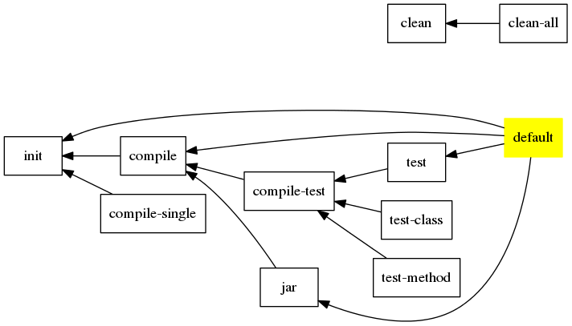

Build Java
==========

[build-java.xml](/.ant/build-java.xml)

Basic Information
-----------------

Basic working flow for java development.

Project Layout
--------------

directory           | property          | description
---------           | --------          | -----------
src                 | src.dir           | source file directory
test                | test.dir          | test source file directory
res                 | res.dir           | resource file directory
lib                 | lib.dir           | library directory
build               | build.dir         | build output directory
build/classes       | build.classes.dir | source file build output directory
build/test/classes  | build.test.dir    | test source file build output directory
build/test/result   | test.result.dir   | test result output directory
build/jar           | build.jar.dir     | jar file build output directory

    ./
    |_src/
    |_test/
    |_res/
    | |_META-INF
    |_lib/
    | |_master
    | |_compile
    | |_runtime
    | |_test
    |_build/
      |_classes/
      |_test/
      | |_classes/
      | |_result/
      |_jar
      |_META-INF/

Task Graph
----------

-------------------------------------------------------------------------------

Default import
--------------

* [ant-git](ant-git.md)
* [ant-exist](ant-exist.md)
* [ant-classpath](ant-classpath.md)

Build Script Require
--------------------

no

Property Require
----------------

no

-------------------------------------------------------------------------------

Global Property
---------------

property            | value                         | type      | description
--------            | -----                         | ----      | -----------
define.java         |                               |           | define this build script is imported
src.dir             | src                           | directory | source directory
test.dir            | test                          | directory | test source directory
build.dir           | build                         | directory | build project output directory
res.dir             | res                           | directory | resource directory
lib.dir             | lib                           | directory | external library directory
lib.master.dir      | `${lib.dir}`/master           | directory |
lib.compile.dir     | `${lib.dir}`/compile          | directory | compile-time use only
lib.runtime.dir     | `${lib.dir}`/runtime          | directory | runtime use only
lib.test.dir        | `${lib.dir}`/test             | directory | test-time use only

Pre-Defined Property
--------------------

property            | value                         | type      | task  | description
--------            | -----                         | ----      | ----  | -----------
project.name        | `${ant.project.name}`         | string    | -init |
project.version     |                               | string    | -init | use either git-describle or time-stamp
javac.source        | 1.8                           | string    | -init | -source
javac.target        | 1.8                           | string    | -init | -target
javac.debug         | true                          | bool      | -init |
javac.verbose       | true                          | bool      | -init | -verbose
javac.jvmargs       |                               | arg-line  | -init |
javac.list-file     | true                          | bool      | -init |
src.include         | **                            | glob      | -init |
src.exclude         |                               | glob      | -init |
java.jvmargs        |                               | arg-line  |       |
test.jvmargs        |                               | arg-line  |       |
jar.file            | `${project.name}`-`${project.version}`.jar | file | -init |
jar.lib.copy        | true                          | bool      | -init | copy lib to jar anr set Class-Path in manifest file
jar.lib.dir         | lib                           | directory | -init | library directory used in jar manifest classpath
build.classes.dir   | `${build.dir}`/classes        | directory | -init |
build.test.dir      | `${build.dir}`/test/classes   | directory | -init |
build.javadoc.dir   | `${build.dir}`/javadoc        | directory | -init |
build.jar.dir       | `${build.dir}`/jar            | directory | -init |
build.meta.dir      | `${build.dir}`/META           | directory | -init |
test.result.dir     | `${build.dir}`/test/result    | directory | -init |
master.classpath    |                               | classpath | -init-classpath | join into compile, runtime, test
compile.classpath   |                               | classpath | -init-classpath |
runtime.classpath   |                               | classpath | -init-classpath |
test.classpath      |                               | classpath | -init-classpath |
classpath           |                               | classpath | -init-classpath |
real.compile.classpath |                            | classpath | -init-classpath | join all compile-relative classpath
real.runtime.classpath |                            | classpath | -init-classpath | join all runtime-relative classpath
real.test.classpath |                               | classpath | -init-classpath | join all test-relative classpath
exist.test          |                               | bool      | -test-init | does directory `${build.test.dir}` exist?
exist.manifest.file |                               | bool      | -jar-init | does file `${manifest.file}` exist?
exist.splash.file   |                               | bool      | -jar-init | does file `${splash.file}` exist?
exist.readme.file   |                               | bool      | -jar-init | does file `${readme.file}` exist?
exist.meta.dir      |                               | bool      | -jar-init | does directory `${res.dir}`/META-INF exist?
jar.manifest.file   | `${build.dir}`/MANIFEST.MF    | file      | -jar-init |

Custom Define Property
----------------------

property                | type      | task used     | description
--------                | ----      | ---------     | -----------
class                   | class     | test-class, test-method | unit test a class
mathod                  | method    | test-method   | unit test a method
manifest.file           | file      | jar           | the template manifest file
jar.resource.fileset    | fileset   | jar           | the directory compressed into jar file
main.class              | class     | jar           | set the Main-Class in manifest file
readme.file             | file      | jar           |
splash.image            | file      | jar           | set the splash image

-------------------------------------------------------------------------------

Extension Point
---------------

### -pre-init

### -post-init

### -pre-compile

### -post-compile

### -pre-compile-test

### -post-compile-test

### -pre-jar

### -post-jar

### -pre-test

### -post-test

### -post-clean

-------------------------------------------------------------------------------

Task
----

### init

### compile

compile java file under `${src.dir}`

### compile-single

compile java file `${class}`

### compile-test

compile java file under `${test.dir}`

### test

unit test with all test file under `${test.dir}`

### test-class

unit test with test class `${class}`

### test-method

unit test a method with test class `${class}` and method `${method}`

### jar

build jar file

### clean

delete `${build.dir}`

### clean-all

delete `${build.dir}` and `${lib.dir}`

-------------------------------------------------------------------------------

Macro
-----

### macro-javac

defined by task __-def-macro-javac__

pre-set reference to [javac task][ant-task-javac] attribute

attribute   | task-attribute    | default value     | description
---------   | -------------     | -----------       | -----------
src         | srcdir            | (required)        |
dest        | destdir           | (required)        |
includes    | includes          | `${src.include}`  |
excludes    | excludes          | `${src.exclude}`  |
            | source            | `${javac.source}` |
            | target            | `${javac.target}` |
            | debug             | `${javac.debug}`  |
            | verbose           | `${javac.verbose}` |
            | listfiles         | `${javac.list-file}` |
            | includeantruntime | no                |
            | includejavaruntime | no               |
            | fork              | true              |
            | failonerror       | true              |

element     | implicit  | optional  | description
-------     | --------  | --------  | -----------
customize   | true      | true      | `javac` task nest elements

### macro-test

defined by task __-def-macro-test__

pre-set reference to [junit task][ant-task-junit]

attribute   | task-attribute    | default value     | description
---------   | -------------     | -----------       | -----------
output      | tempdir           | (required)        |
            | printsummary      | withOutAndErr     |
            | haltonfailure     | false             |
            | haltonerror       | false             |
            | fork              | true              |
            | failureproperty   | test.fail         |

element     | implicit  | optional  | description
-------     | --------  | --------  | -----------
customize   | true      | false     | `junit` task nest elements

-------------------------------------------------------------------------------

See Also
--------

[ant-task-javac]: http://ant.apache.org/manual/Tasks/javac.html
[ant-task-junit]: http://ant.apache.org/manual/Tasks/junit.html