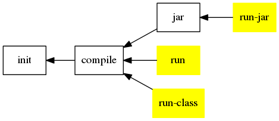

Build Script Template
=====================

Basic Information
-----------------

provide java application relative task which has the main class in the project.

Task Graph
----------

-------------------------------------------------------------------------------

Default import
-------------

* [ant-exist](ant-exist.md)

Build Script Require
--------------------

* [build-java](build-java.md)

Property Require
----------------

property                | type      | task used     | description
--------                | ----      | ---------     | -----------
main.class              | class     | run           | fail if not set
class                   | class     | run-class     | fail if not set

-------------------------------------------------------------------------------

Global Property
---------------

property            | value     | type      | description
--------            | -----     | ----      | -----------
define.application  |           |           | defined this build script is imported

Pre-Defined Property
--------------------

property            | value     | type      | task  | description
--------            | -----     | ----      | ----  | -----------
java.jvmargs        |           | line      | (all) | jvm arguments
program.args        |           | line      | (all) | program arguments

Custom Define Property
----------------------

property                | type      | task used     | description
--------                | ----      | ---------     | -----------
config                  | file      | run           | running property config file, override build.properties

-------------------------------------------------------------------------------

Extension Point
---------------

### -pre-run
### -post-run

-------------------------------------------------------------------------------

Task
----

### run
### run-class
### run-jar

-------------------------------------------------------------------------------

See Also
--------

