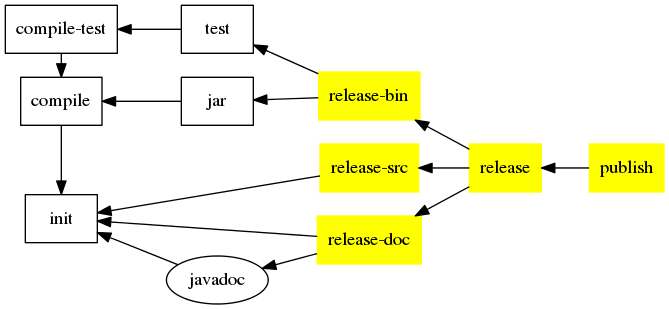

Build Script Template
=====================

[java-publish.xml](/.ant/java-publish.xml)

Basic Information
-----------------

provide publish relative task. Use ivy

Task Graph
----------

-------------------------------------------------------------------------------

Default import
-------------

Build Script Require
--------------------

* [build-java](build-java.md)
* [java-ivy](java-ivy.md)
* [java-javadoc](java-javadoc.md)
* [ant-git](ant-git.md) (optional)

Property Require
----------------

property                | type      | task used     | description
--------                | ----      | ---------     | -----------
project.version         | text      | (all)         |
release.bin.fileset     | fileset   | release-bin   | binary fileset

-------------------------------------------------------------------------------

Global Property
---------------

property            | value     | type      | description
--------            | -----     | ----      | -----------
define.publish      |           |           | defined this build script is imported
release.dir         | release   | directory |

Pre-Defined Property
--------------------

property            | value     | type      | task      | description
--------            | -----     | ----      | ----      | -----------
publish.resolver    | local     | text      | publish   |
publish.status      | release   | text      | publish   |
publish.overwrite   | true      | bool      | publish   |
publish.update      | true      | bool      | publish   |
publish.forcedeliver| true      | bool      | publish   |

Custom Define Property
----------------------

property                | type      | task used     | description
--------                | ----      | ---------     | -----------
release.src.fileset     | fileset   | release-src   | source fileset. \*1

\*1 If not defined, call task __git-ls-files__. If ant-git.xml doesn't import, use default fileset which include
`.ant/*.xml`, `build.xml`, `build.properties`, `ivy.xml`, `${readme.file}`, `${res.dir}/**/*`, `${src.dir}/**/*`
 , `${test.dir}/**/*`

-------------------------------------------------------------------------------

Extension Point
---------------

### -pre-release
### -post-release
### -pre-publish
### -post-publish

-------------------------------------------------------------------------------

Task
----

### release
### release-bin

default output file pattern `${release.dir}/${project.version}/${project.name}.zip`

### release-src

default output file pattern `${release.dir}/${project.version}/${project.name}-source.zip`

### release-doc

default output file pattern `${release.dir}/${project.version}/${project.name}-javadoc.zip`

### publish

-------------------------------------------------------------------------------

See Also
--------

Bug Note
--------

